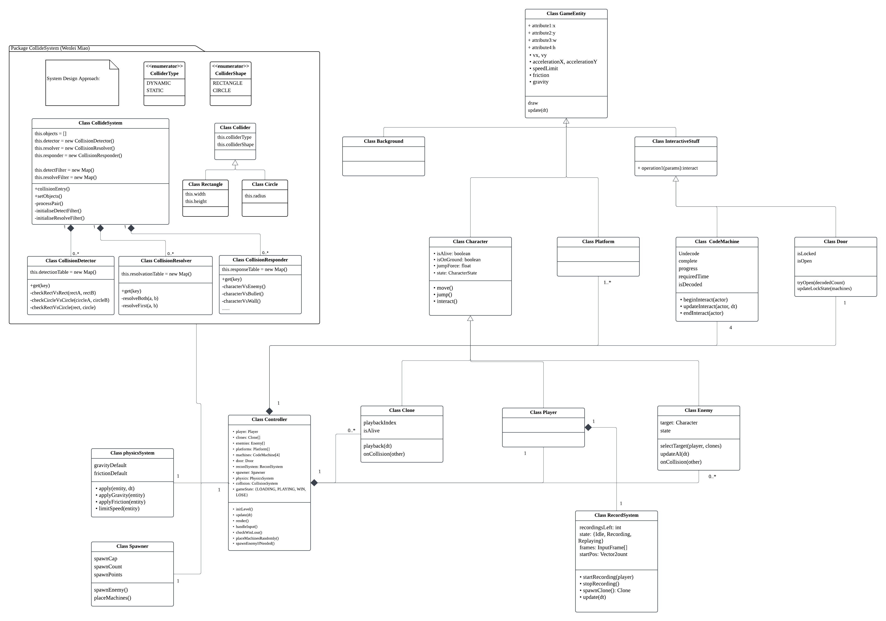

# 2026-group-13
2026 COMSM0166 group 13

## Info

You will be developing your game using [P5.js](https://p5js.org) a javascript library that provides you will all the tools you need to make your game. However, we won't be teaching you javascript, this is a chance for you and your team to learn a (friendly) new language and framework quickly, something you will almost certainly have to do with your summer project and in future. There is a lot of documentation online, you can start with:

- [P5.js tutorials](https://p5js.org/tutorials/) 
- [Coding Train P5.js](https://thecodingtrain.com/tracks/code-programming-with-p5-js) course - go here for enthusiastic video tutorials from Dan Shiffman (recommended!)

## U Help U

Take control of both 'Your Past Self' and 'Your Present Self' — bring the two versions of you together in one timeline to collaborate and conquer the challenges!

IMAGE. Add an image of your game here, keep this updated with a snapshot of your latest development.

LINK. Add a link here to your deployed game, you can also make the image above link to your game if you wish. Your game lives in the [/docs](/docs) folder, and is published using Github pages. 

VIDEO. Include a demo video of your game here (you don't have to wait until the end, you can insert a work in progress video)

## Game Demo
**[Click here to play our U help U Demo1 now!](https://uob-comsm0166.github.io/2026-group-13/Demo1)**

## Your Group

- Group member 1, Zhiqing Zhang, ek25873@bristol.ac.uk, role
- Group member 2, Siqi Xu, lv25773@bristol.ac.uk, role
- Group member 3, Xuelin Ma, pw25500@bristol.ac.uk, role
- Group member 4, Yiyuan Yao, jg25755@bristol.ac.uk, role
- Group member 5, Jingran Zhang, sx25997@bristol.ac.uk, role
- Group member 6, Wenlei Miao, hz25681@bristol.ac.uk, role

## Project Report

### Introduction

 ***U help U***

《U Help U》是一款 2D 横板跳跃类 “自我协作” 解谜游戏，核心创意是：玩家操控 “现在的自己” 录制行动，回放时生成 “过去的自己”—— 这个 “过去的自己” 会完整复现录制时的操作与物理轨迹，作为 “实心协作单位” 与 “现在的自己” 双向互踩、互相辅助，通过 “过去的自己助力现在的自己” 突破地形障碍，最终达成关卡目标。游戏没有敌人，核心挑战在于 “预判过去与现在的行动配合”，传递 “每一次尝试都有价值，过去的经历会成为现在的底气” 的核心体验。

"U Help U" is a 2D side-scrolling platformer puzzle game centered around the core concept of "self-collaboration". Players control "Your Present Self" to record actions, and upon playback, "Your Past Self" is generated — this past incarnation fully reproduces the recorded operations and physical trajectories. Acting as a solid collaborative unit, it interacts with "Your Present Self" through mutual standing (both can stand firmly on top of each other without slipping or phasing through) and mutual assistance. By leveraging "Your Past Self to empower Your Present Self," players overcome terrain obstacles to ultimately achieve the level objectives.

Players progress through the game one level at a time, with each level functioning as an independent challenge. After completing a stage, they simply move on to the next one.

 ***核心玩法（How to Play）​***
#### 1. Basic Controls (Applies to all modes)​

Movement: A/D keys (horizontal movement only)​

Jump: W key or Space bar (no restrictions; jump at any time; supports consecutive jumps in mid-air)​

Record / Replay: R key (toggles recording on/off and triggers replay)

#### 2. Three Core Modes (Closed-Loop Process)​

(1) Exploration Mode (Initial State)​

The player controls ‘Present Self’ (main character), freely exploring the level’s terrain (floors, floating platforms), observing the layout of obstacles, and planning the route that ‘Past Self’ must follow to coordinate with them.​

Core Rule: ‘Present Self’ is subject to gravity and can stand on floors and platforms without any other restrictions; at this stage, there is no ‘Past Self’, so the focus is solely on exploring the scene and planning strategy.​

(2) Recording Mode (activated by pressing the R key)​

Once activated, a “Recording” prompt appears at the top left of the screen. The recording lasts for 10 seconds, during which “Present Self”’s movements (moving left/right, jumping) are recorded frame by frame — recording “control commands” rather than fixed positions, ensuring compliance with physical laws during playback.​

Core rule: During recording, the ‘present self’ remains free to move and must independently plan ‘valuable collaborative trajectories’ (such as stopping at key elevated platforms, moving to specific support positions, or completing a sequence of jumps); no ‘past self’ is generated during recording, only action data is logged.

Press the R key again or wait for the countdown to end to stop recording. The game will automatically switch to “Co-op Replay Mode” and generate a “Past Self” (clone).​

(3) Collaborative Replay Mode (entered automatically upon completion of recording)​

The “present self” remains controllable, whilst the “past self” calculates its physical trajectory in real time based on the recorded commands (fully reproducing the actions taken during recording; subject to gravity and terrain, not a fixed script).​

#### Core Rules:​

Both the ‘present self’ and the ‘past self’ possess the ‘solid box’ physical property, allowing them to stand on top of one another in both directions (the present self can stand on the past self, and the past self can stand on the present self; they remain stable without slipping or passing through one another).​

The two cannot overlap horizontally (they are automatically pushed apart horizontally upon collision), but may stand on top of one another vertically without interfering with each other’s movement logic.

During playback, the player controls ‘Present Self’ to use ‘Past Self’s’ trajectory to overcome obstacles (for example, standing on ‘Past Self’s’ shoulders to jump onto a higher platform, or having ‘Past Self’ pause in mid-air to serve as a temporary springboard).

If you need to adjust the actions of the ‘past self’, press the R key again to pause the replay, return to ‘Exploration Mode’ and re-record (the new recording will overwrite the old ‘past self’; only one ‘past self’ can exist at a time).

Once the replay has finished (and all recorded action frames have been executed), the ‘past self’ will automatically disappear, returning to ‘Exploration Mode’, where you can record a new ‘past self’.​

#### 3. Physical Rules (Core Consensus)​

Both the ‘present self’ and the ‘past self’ are subject to gravity and fall naturally, following the same physical principles.​

Both can stand on the floor, a floating platform, or on top of the other (standing vertically against them, with velocity reduced to zero, and maintaining a stable stance); they are both solid, impenetrable units.​

 ***游戏目标（Game Goal）​​***
1. Level Objectives​ 

Fundamental Objective：

Navigate the "Present Self" to the designated terminal point (e.g., visual markers such as green flags or luminous portals).

Advanced Objectives：​

Minimum Recording Cycles: Complete the level with the fewest recordings of the "Past Self" to evaluate the player’s strategic planning efficiency;

Optimized Execution: Achieve a "one-take" recording where every action serves a collaborative purpose, eliminating redundant movements or technical waste.

Hidden Objectives：

Collectible Acquisition: Retrieve "Time Shards" scattered across elevated or obscured locations, requiring synchronized coordination between the Past and Present avatars.​

2. Core Experience Goals

Provide players with an intuitive sense of "collaborating with one's past," fostering a rewarding feeling of self-transcendence;

Cultivate spatial reasoning and proactive planning, requiring players to envision how "past actions" pave the way for "present breakthroughs";

Convey the theme of personal growth—that no attempt is futile, as one's past efforts serve as a foundation for present success.

四、Core Highlights (Differentiation)

Immersive "Past-Present" Integration

​Action-Based Recording vs. Positional Recording: The trajectory of the "Past Self" is calculated via real-time physics rather than static scripts. For instance, if a player jumps onto a platform during recording, the "Present Self" can use the "Past Self's" shoulders as a dynamic platform to reach higher ground.

Bidirectional Interaction: Both entities function as physical platforms for one another. This transcends the traditional "one-way support" trope, allowing for complex "leapfrogging" strategies ($A$ supports $B$, and $B$ subsequently supports $A$), expanding the creative and tactical depth of the gameplay.

Non-Punitive Environment: By removing time constraints and death penalties, the game encourages iterative recording and adjustment. This allows players to focus on the joy of collaborative planning while mitigating puzzle-solving anxiety.

Visual Clarity: Utilizing high-contrast character designs (Solid White for "Present"; Translucent Blue for "Past") against a pink backdrop, supplemented by "NOW/PAST" UI indicators. This minimizes cognitive load and allows players to focus entirely on the logic of collaboration.

### Requirements 

#### Skateholders

#### 1. Players

- pro player

- New player

- Potential Playerr

- normal player

#### 2. Designers

- lever designer

- UI designer

- art designer

- story designer

#### 3. Developer(Coder)

#### 4. Tester

#### 5. lecturer/TA

#### 6. Competitor

#### 7. Community member

#### 8. Software Engineering Module

#### 9. Platform：p5js

#### 10. Market-Related Personnel

- Marketing Specialist

- Market Researcher

- Promotion Specialist

#### Reflection

### Design

- 15% ~750 words 
- System architecture. Class diagrams, behavioural diagrams. 
#### Class Diagram

> ⚠️Work in Progress

### Implementation

- 15% ~750 words

- Describe implementation of your game, in particular highlighting the TWO areas of *technical challenge* in developing your game. 

### Evaluation

- 15% ~750 words
- One qualitative evaluation (of your choice)
- One quantitative evaluation (of your choice) 
- Description of how code was tested. 

### --- Qualitative ---

#### (1) Contextual Onboarding & Bilingual Support

Issue: Players require clearer, real-time guidance on game controls and mechanics. Static instructions are insufficient.

Action Plan: Implement bilingual (English and Chinese) proximity-based tooltips. Following the TA's recommendation, UI prompts (e.g., "Press [E] to interact" / "按 [E] 互动") will dynamically appear when the player's character approaches specific interactive elements, such as buttons or traps.

This aligns with Nielsen's "Recognition rather than recall". By providing contextual instructions exactly when and where they are needed, we significantly reduce the players' cognitive memory load.

#### (2) Learning Curve & Scaffolding (Level 0)

Issue: Transitioning directly into Level 1 introduces too many mechanics at once, causing a steep learning curve for new players.

Action Plan: Design and insert a simple "Tutorial Level" (Level 0) prior to the first official stage. This safe, low-stakes environment will allow players to practice basic movements and test the core mechanics without the threat of failing. It doesn't need to be too complex; it should mainly introduce the game's controls to new players.

This addresses "Error prevention" and enhances "User control and freedom", ensuring players are comfortable with the physics and controls before facing actual challenges.

#### (3) Narrative Context & Conceptual Mapping

Issue: The core gameplay loop (the time-clone mechanic) feels abstract without a narrative foundation.

Action Plan: Introduce a brief narrative sequence or story screen at the start of the game. This will establish the world's lore, explaining the concept of manipulating time and cooperating with one's "past self" and "present self" to solve puzzles.

This improves the "Match between system and the real world". Providing a narrative metaphor (co-op with a past self) makes the complex time-manipulation mechanic more intuitive and mentally accessible for the player.

### --- Quantitative ---

#### Evaluation Findings

We conducted a quantitative user evaluation with 10 participants, using a within-subjects design to compare the user experience between Level 1 and Level 2. Participants completed the NASA Task Load Index (TLX) and System Usability Scale (SUS) after playing each level. We then ran a Wilcoxon Signed-Rank Test (with an alpha level of 0.05) to determine if there were significant differences in perceived workload and usability.

* **System Usability Scale (SUS):** The test yielded **W = 21.0** and **p = 0.857**. Since p > 0.05, there is **no significant difference** in usability between the two levels. Both levels scored well above the industry average of 68 (Level 1 mean: 71.5; Level 2 mean: 73.25). This is a positive outcome, indicating that our core UI and control mechanics remain stable, intuitive, and easy to use regardless of the difficulty progression.

* **NASA Task Load Index (TLX):** The test yielded **W = 10.0** and **p = 0.138**. Since p > 0.05, there is **no significant difference** in perceived workload between the two levels. Although the absolute mean score increased from 37.93 (Level 1) to 46.67 (Level 2), the lack of statistical significance suggests a strong "learning effect." Players mastered the mechanics in the first level, which counteracted the static difficulty increase in the second level.

#### Reconsidered Technical Challenges

Based on the quantitative evaluation results and the core mechanics of our time-clone puzzle platformer, we have reconsidered our primary technical challenges for the ongoing development:

#### Technical Challenge 1: Algorithm-Driven Dynamic Difficulty Adjustment & State Machine Refactoring
* **Context:** Our Wilcoxon Signed-Rank Test for NASA TLX revealed that static level design fails to produce a statistically significant increase in cognitive workload due to player learning effects.
* **Challenge:** Breaking away from hard-coded difficulty scaling by implementing a Dynamic Difficulty Adjustment (DDA) algorithm. The technical hurdle involves building a background system to parse real-time player metrics (e.g., completion time, clone usage efficiency) and refactoring the Finite State Machines (FSM) of environmental hazards and enemies. The FSMs must dynamically interpret DDA parameters to alter attack wind-up frames, movement speeds, or pathfinding algorithms on the fly, ensuring a consistent and measurable escalation of cognitive load.

#### Technical Challenge 2: Deterministic Replay and Physics State Synchronization for Clones
* **Context:** The core gameplay loop relies heavily on recording player inputs and generating "ghost clones" to replay actions for cooperative puzzle-solving.
* **Challenge:** Achieving absolute "deterministic replay" within the JavaScript/p5.js environment. Frame rate (FPS) fluctuations and unstable delta times cause spatial drift if coordinates are simply recorded frame-by-frame, leading to critical physics and collision failures during replay (e.g., a clone narrowly missing a trigger button). The technical complexity lies in designing a robust Input Recorder using a Fixed Time Step to sample and replay input vectors, ensuring 100% physical state synchronization and collision accuracy between the main entity and its clones across complex platforming sequences.

#### Technical Challenge 3: Decoupling Complex Puzzle Logic via Event-Driven Architecture**
* **Context:** As levels become more intricate, managing interactions between the main player, multiple clones, various switches, timed doors, and traps using standard conditional statements (`if/else`) leads to highly coupled, unmaintainable "spaghetti code."
* **Challenge:** Refactoring the game's core interaction logic by implementing an Event-Driven Architecture (such as the Observer pattern or an Event Bus system). The technical difficulty is designing a centralized event dispatcher that allows entities to communicate asynchronously. For example, a pressure plate simply broadcasts a "stepped_on" event, and any linked door or trap listens for this event to trigger its animation and state change. This eliminates direct hard-coded dependencies and lays the technical groundwork for highly scalable and complex puzzle designs.

### Process 

- 15% ~750 words

- Teamwork. How did you work together, what tools and methods did you use? Did you define team roles? Reflection on how you worked together. Be honest, we want to hear about what didn't work as well as what did work, and importantly how your team adapted throughout the project.

### Conclusion

- 10% ~500 words

- Reflect on the project as a whole. Lessons learnt. Reflect on challenges. Future work, describe both immediate next steps for your current game and also what you would potentially do if you had chance to develop a sequel.

### Contribution Statement

- Provide a table of everyone's contribution, which *may* be used to weight individual grades. We expect that the contribution will be split evenly across team-members in most cases. Please let us know as soon as possible if there are any issues with teamwork as soon as they are apparent and we will do our best to help your team work harmoniously together.

### Additional Marks

You can delete this section in your own repo, it's just here for information. in addition to the marks above, we will be marking you on the following two points:

- **Quality** of report writing, presentation, use of figures and visual material (5% of report grade) 
  - Please write in a clear concise manner suitable for an interested layperson. Write as if this repo was publicly available.
- **Documentation** of code (5% of report grade)
  - Organise your code so that it could easily be picked up by another team in the future and developed further.
  - Is your repo clearly organised? Is code well commented throughout?
