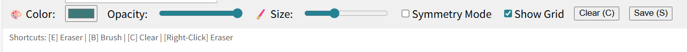
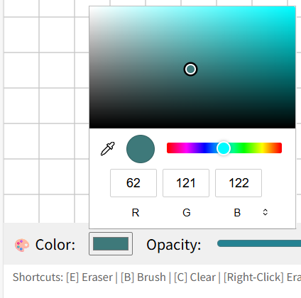

# 🎨 Paint App

Welcome to our painting application built with p5.js !

👇 **Click the button below to start painting**

  <a href="https://uob-comsm0166.github.io/2026-group-13/" style="font-size: 22px; font-weight: bold;">
    🚀 Launch the Paint App
  </a>

---

### Here is a preview of the painting app:

  

### Toolbar:

  

### Color Picker:

  

---

*All source files for the sketch are located in this folder (`docs`).*