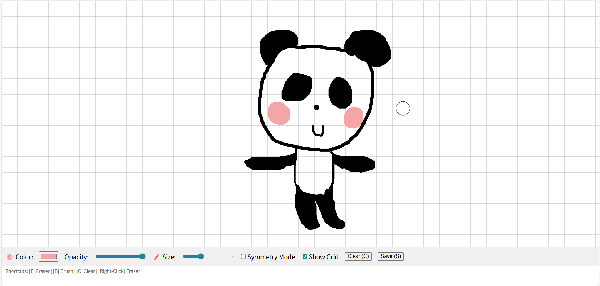
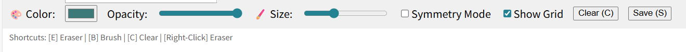
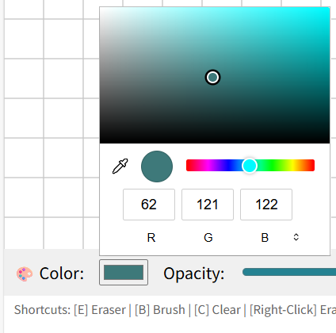
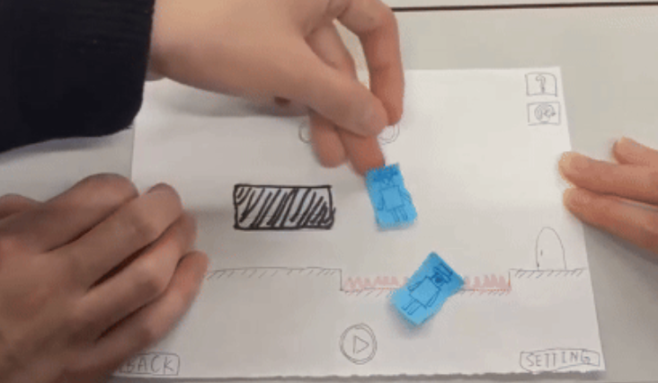
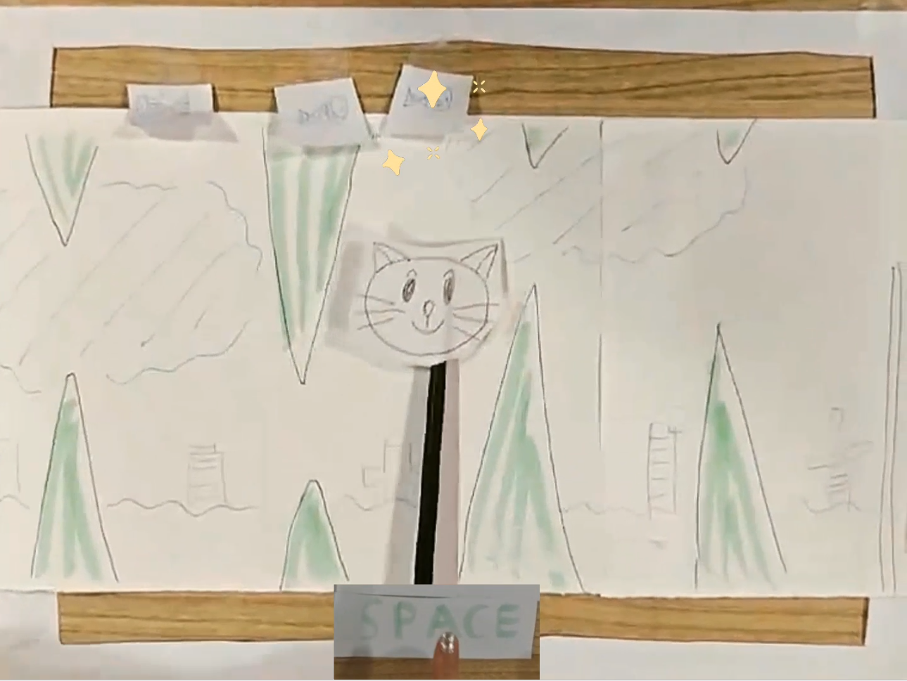

# 🎨 Paint App

&emsp;&emsp;Welcome to our painting application built with p5.js !

👇 **Click the button below to start painting**

	<a href="https://moosry.github.io/p5.js-Paint-App/" target="_blank" style="font-size: 28px; font-weight: bold;">
		🚀 Launch the Paint App
	</a>

---

### Here is a preview of the painting app:

	

### Toolbar:

	

### Color Picker:

	

---

_All source files for the sketch are located in this folder (`paint-app`)._

## Game Idea 01 Summary: U help U

	

&emsp;&emsp;U help U is a level-based side-scrolling puzzle platformer built around a record-and-replay mechanic: players record actions, then cooperate with their “past selves” to solve traversal and timing challenges. Core interactions include using past selves as stepping stones, holding buttons, coordinating combat, pushing heavy objects together, and strategically placing a movable start point for each recording sequence; later concepts also include loot rewards, between-level upgrades, and an inverted low-gravity world. The design philosophy is to introduce one main mechanic per level for clarity and smooth progression, then gradually combine systems in later stages to create deeper, more creative problem-solving.

## Game Idea 02 Summary: Kitten Run!

	

&emsp;&emsp;Kitten Run! is a casual 2D side-scrolling action mini-game inspired by Flappy Bird, where players guide a kitten through an auto-scrolling obstacle course by timing tap-based flight against gravity. The main objective is to collect fish while avoiding spikes and surviving narrow gaps until reaching the end-of-level victory marker, creating a fast retry loop that emphasizes responsiveness and rhythm. Its intended appeal comes from simple controls, cute visual style, and satisfying progression, while key implementation risks include collision hitbox fairness, gravity/jump tuning, and careful obstacle spacing to keep difficulty challenging but beatable.
