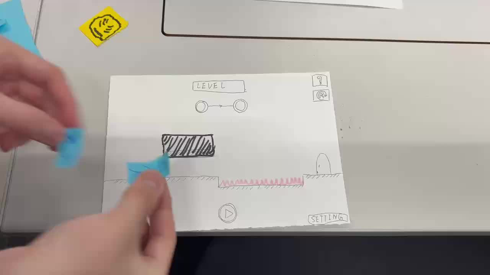
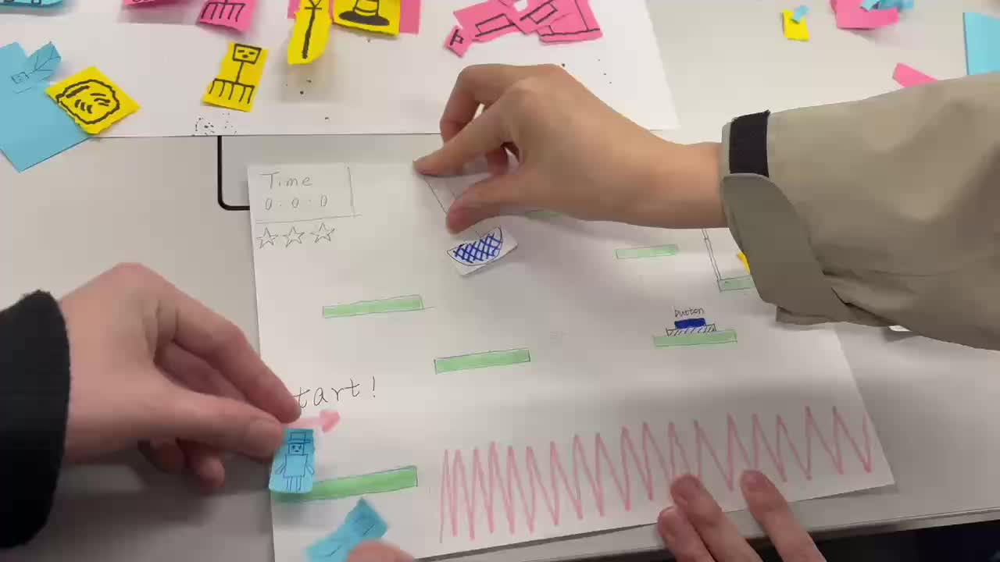

# Week 03: Paper Prototypes and Final Game Idea

## Paper Prototype Testing

This week, we created and tested two paper prototypes to evaluate the feasibility, player experience, and development potential of our early game ideas. The goal of this stage was not only to visualise the game concepts, but also to identify design risks before implementation.

The two tested prototypes were:

- ***U help U***: a puzzle platformer based on cooperation between the player and their recorded past self.
- ***Kitten Run!***: a casual side-scrolling game focused on simple controls, cute visuals, and quick reactions.

Through physical paper testing, we observed how players understood the rules, interacted with the game objects, and responded to the difficulty of each concept.

---

## Prototype 1: *U help U*

*U help U* is a puzzle-platform game built around a record-and-replay mechanic. The player can record their own actions and then use a past version of themselves to solve puzzles, activate mechanisms, cross dangerous areas, or create platforms for future movement.

  Click the button below to watch the paper prototype video.

  

  

<b>Figure 1: Main menu paper prototype for <i>U help U</i></b>

  

<b>Figure 2: First level paper prototype for <i>U help U</i></b>

  

<b>Figure 3: Second level paper prototype for <i>U help U</i></b>

### Key Findings from Testing

- Players understood the main idea of cooperating with a past self, but the mechanic required clear guidance and feedback.
- The recorded actions had to be very precise. If the past self stood even slightly away from the intended position, the whole puzzle could fail.
- Players often forgot what their previous recorded self was going to do, especially when timing and movement sequences became longer.
- The difficulty increased quickly when multiple past selves were involved, because they could block paths or interfere with each other.
- Level design for this mechanic is more complex than a standard platformer, because each level requires careful timing, positioning, and fail-safe design.

### Additional Requirements Identified

Based on the test results, *U help U* requires:

- A fast re-recording system to reduce player frustration.
- A tolerance or auto-snap system to make puzzle execution less punishing.
- A ghost preview system to show the planned movement of the recorded self.
- Strict control of level complexity, especially when multiple clones are involved.
- A level editor or testing tool to help design and verify puzzle solutions.

---

## Prototype 2: *Kitten Run!*

*Kitten Run!* is a casual game concept where the player controls a kitten moving through obstacles. The idea focuses on simple interaction, quick understanding, and a cute visual style.

  Click the button below to watch the paper prototype video.

  

  

<b>Figure 4: Paper prototype for <i>Kitten Run!</i></b>

### Key Findings from Testing

- Players could understand the core gameplay very quickly.
- However, the gameplay also became repetitive after a short time.
- Paper testing could not accurately simulate important details such as jump height, hitbox size, obstacle speed, and movement feel.
- The game would rely heavily on art quality, animation, and sound effects to stand out.

### Additional Requirements Identified

Based on the test results, *Kitten Run!* requires:

- More rhythm variations, such as speed changes, moving obstacles, wind, or slow-down effects.
- Reward systems such as combos, streak bonuses, or collectible rewards.
- More visual variety through different themes and backgrounds.
- Precise hitbox design and movement tuning.
- High-quality cute art, smooth animations, and responsive sound effects.

---

## Comparison of the Two Ideas

| Aspect | *U help U* | *Kitten Run!* |
| --- | --- | --- |
| Core Mechanic | Record and replay the player's past actions | Simple movement and obstacle avoidance |
| Player Learning Curve | Higher, but more meaningful | Very easy to understand |
| Gameplay Depth | Strong potential for puzzle design and mechanic combinations | Limited unless many extra systems are added |
| Development Risk | Higher due to timing, collision, replay, and level design | Lower, but depends heavily on polish |
| Main Design Challenge | Making the record/replay mechanic clear, fair, and enjoyable | Avoiding repetition and improving visual appeal |
| Long-term Potential | High, because new levels can explore different uses of the clone mechanic | Medium to low, because replay value mainly comes from more content |

---

## Final Decision: *U help U*

After comparing both paper prototypes, we decided to continue developing ***U help U*** as our final game idea.

Although *Kitten Run!* is easier to understand and simpler to implement, its gameplay ceiling is relatively low. Most improvements would depend on adding more content, skins, visual polish, or extra modes. These additions could make the game more attractive, but they would not significantly deepen the core mechanic.

By contrast, *U help U* revealed more design and technical requirements during testing, but these requirements directly strengthen the game. Systems such as ghost previews, tolerance design, re-recording, and level editing all support the central mechanic and make the game more unique.

Therefore, we believe *U help U* has stronger potential as a group project because it provides:

- A clearer and more innovative core mechanic.
- More opportunities for puzzle design and level progression.
- Better potential for technical implementation challenges.
- More space for meaningful player learning and experimentation.

---

## Next Steps

Our next development stage will focus on turning the paper prototype into a playable digital prototype. The main tasks include:

- Implementing basic player movement and platform collision.
- Building the record-and-replay system.
- Creating a simple clone or past-self entity.
- Designing a small test level around one clear puzzle.
- Testing whether the mechanic remains understandable and enjoyable in digital form.