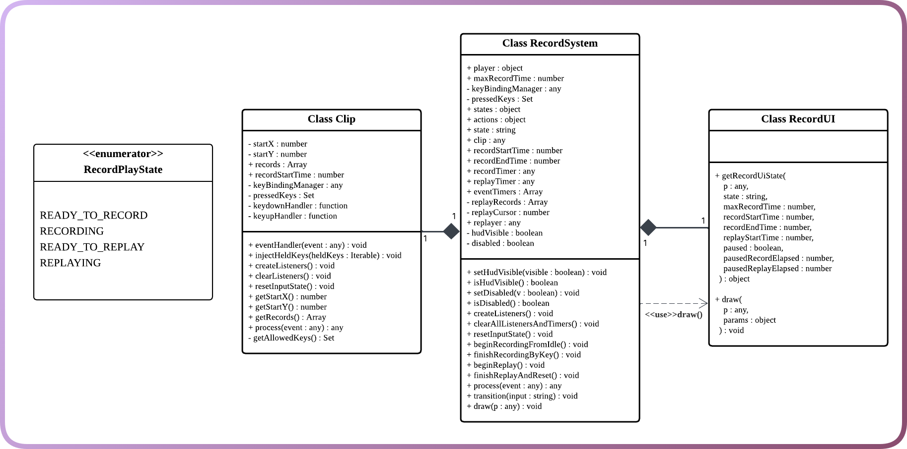
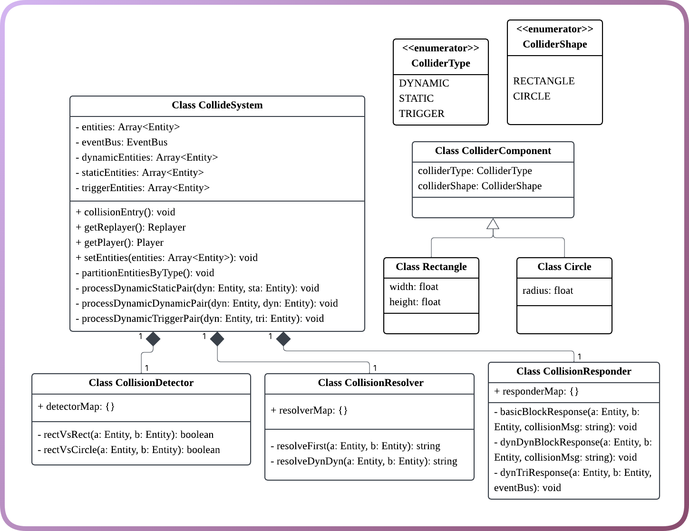
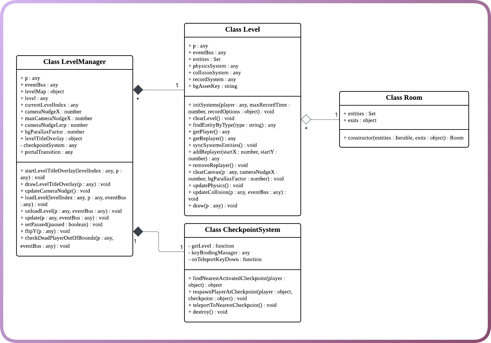

# Week 05 Tasks: Design Diagrams and Basic Implementation

<br>

This week, our team moved from requirements analysis into early system design and initial code construction. Following the Week 05 task requirements, we worked through the provided examples as a team, drew class diagrams and behavioural diagrams for the game, and began implementing the basic class structure with the Minimum Viable Product (MVP) in mind.

<br>

## Weekly Objectives

- Finish working through the examples in our team.
- Draw up class diagrams and behavioural / sequence diagrams for the game.
- Add the diagrams to the repository under the design section.
- Begin the basic implementation of the game classes.
- Prepare the project structure for the first sprint during reading week.

<br>

## Design Overview

Our game is a 2D platform puzzle game based on a **record-and-replay clone mechanic**. To support this mechanic, we divided the system into several core modules:

- **Game Entity Model**: defines the shared structure of game objects such as players, clones, enemies, platforms, buttons, spikes, portals, and walls.
- **Character Control System**: handles player input, movement intention, action validation, and physics application.
- **Collision System**: detects and resolves collisions between dynamic, static, and trigger entities.
- **Record System**: manages recording, replaying, clone spawning, and recording UI feedback.
- **Level Manager**: loads levels, manages rooms, synchronises entities, and handles checkpoints.
- **UI / Switcher System**: controls page switching, menus, pause pages, settings, language selection, and navigation.

These modules were designed to keep the codebase modular, maintainable, and extendable while still focusing on a playable MVP.

<br>

## Top-Level Architecture

<p align="center">
  
</p>

<p align="center"><b>Figure 1: Top-level architecture of the game system</b></p>

The top-level architecture shows how the main app coordinator connects the event bus, page switcher, and level manager. This structure helps separate global coordination from individual gameplay systems. The event bus is used to reduce direct coupling between modules, while the level manager focuses on loading, updating, and unloading the active level.

<br>

## Core Game Entity Model

<p align="center">
  
</p>

<p align="center"><b>Figure 2: Game entity class diagram</b></p>

The `GameEntity` model is the foundation of our game object structure. Most visible and interactive objects inherit from this shared base structure, including the player, replayer, enemy, platform, button, spike, portal, ground, wall, and key prompt.

This design allows each entity to share common methods such as `update()`, `draw()`, and `onDestroy()`, while still allowing specific entities to define their own behaviours. For example, the player and replayer both extend the character structure, but they are controlled differently: the player responds to live input, while the replayer follows previously recorded input.

<br>

## Record System Design

<p align="center">
  
</p>

<p align="center"><b>Figure 3: Record system class diagram</b></p>

The record system is one of the most important systems in our game because it directly supports the core mechanic. It includes:

- `RecordSystem`, which manages the recording state, timers, replay count, and clone creation.
- `Clip`, which stores the recorded input sequence.
- `RecordUI`, which displays recording and replay status to the player.
- `RecordPlayState`, which defines the main states of the record-replay cycle.

<br>

<p align="center">
  
</p>

<p align="center"><b>Figure 4: Record and replay behaviour diagram</b></p>

The behavioural diagram shows the main record-replay flow:

1. The system starts in the **Ready to Record** state.
2. When the player presses the record key, the system enters the **Recording** state.
3. Recording can finish either by pressing the key again or by reaching the time limit.
4. After recording, the system becomes **Ready to Replay**.
5. When replay starts, the clone follows the recorded input sequence.
6. After replay ends, the system resets and becomes ready for another recording cycle.

This helped us clarify the expected state transitions before implementing the full logic in code.

<br>

## Collision and Control Systems

<p align="center">
  
</p>

<p align="center"><b>Figure 5: Collision system class diagram</b></p>

The collision system separates collision detection, collision resolution, and collision response. This makes the system easier to test and extend. For example, static blocks, dynamic entities, and trigger objects can be handled differently without placing all collision logic inside the player or level classes.

<br>

<p align="center">
  
</p>

<p align="center"><b>Figure 6: Character control system class diagram</b></p>

The character control system converts keyboard events into movement intentions, validates whether those actions are allowed, and applies the final movement through the physics layer. This separation helps support both live player control and replayed clone behaviour.

<br>

## Level and UI Management

<p align="center">
  
</p>

<p align="center"><b>Figure 7: Level manager class diagram</b></p>

The level manager is responsible for loading and unloading levels, keeping track of the current level index, updating the camera, managing checkpoints, and connecting the level to major systems such as physics, collision, and recording.

<br>

<p align="center">
  
</p>

<p align="center"><b>Figure 8: UI system class diagram</b></p>

The UI system supports menus, pause pages, buttons, timers, language choices, and keyboard navigation. This allows gameplay logic and interface logic to remain separate, reducing the risk that UI changes will break core game behaviour.

<br>

## Initial Code Structure

Based on the diagrams, we began constructing the basic project folders and class files. The current early implementation is organised around the following main modules:

```text
Animation/
CharacterControlSystem/
CollideSystem/
GameEntityModel/
LevelManager/
RecordSystem/
```

This folder structure reflects the major systems shown in our class diagrams. At this stage, the goal is not to complete all features immediately, but to establish a clean foundation that supports the MVP.

<br>

## MVP-Focused Implementation

To keep the project realistic, we prioritised the systems most necessary for a playable MVP:

| Priority | System | MVP Purpose |
|---|---|---|
| High | Game Entity Model | Provides the shared object structure for all game elements |
| High | Character Control System | Allows the player to move, jump, and interact with levels |
| High | Collision System | Supports platforms, walls, triggers, and hazards |
| High | Record System | Enables the central record-and-replay clone mechanic |
| Medium | Level Manager | Loads levels and connects entities with systems |
| Medium | UI System | Provides basic menus, pause control, and recording feedback |
| Low | Advanced mechanisms | Supports later puzzle expansion and polish |

This MVP-first approach helps us avoid overbuilding and ensures that the core gameplay loop can be tested as early as possible.

<br>

## Weekly Outcome

By the end of Week 05, we completed the initial design stage for the game architecture and started building the corresponding class structure. The diagrams helped us identify system boundaries, clarify responsibilities, and reduce unnecessary coupling between modules.

The most important outcome of this week was that our team moved from abstract requirements into a more concrete software design. We now have a clearer plan for how the core gameplay systems should interact, especially the relationship between player control, collision handling, level management, and the record-replay system.

<br>

## Next Steps

In the next stage, we will focus on the first sprint:

- Implement the core entity classes.
- Connect the player controller with movement and physics.
- Build a simple playable level.
- Implement the first version of the recording and replay system.
- Test whether the player and clone can interact correctly with platforms and triggers.
- Continue refining diagrams if the implementation reveals design changes.
