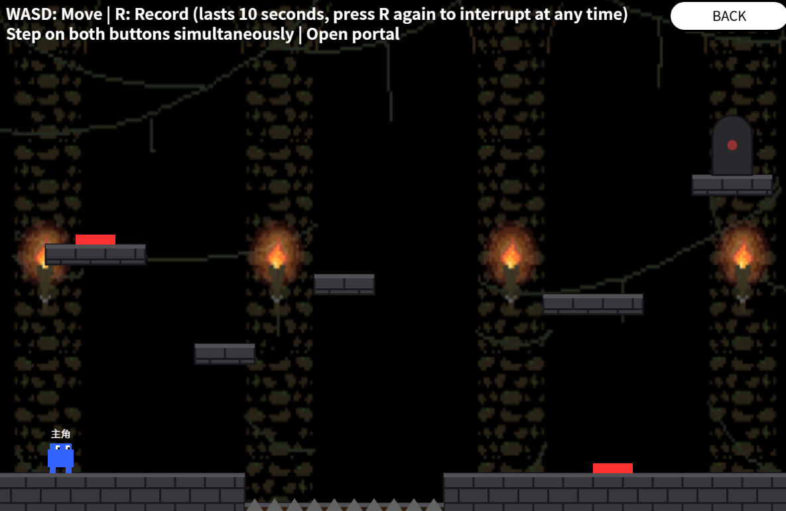

# Week 06 Tasks: First Sprint and Initial Game Demo

<br>

In Week 06, our team completed the **first sprint** and uploaded the first playable demo of *U help U*. This week focused on turning our previous design diagrams and class planning into an executable p5.js prototype. The main goal was to create and upload a working game demo, while keeping the implementation close to the MVP direction defined in earlier weeks.

<br>

## Weekly Objectives

- Complete the first sprint.
- Create and upload the first version of the game demo.
- Implement the initial playable level.
- Connect the basic game loop, UI flow, player control, terrain, obstacles, and recording / replay logic.
- Add visual and audio assets to improve the first playable experience.
- Identify remaining technical issues for the next sprint.

<br>

## Demo Overview

The first demo is a browser-based p5.js platform puzzle prototype. It includes a basic game flow from the main menu to level selection and gameplay. The player can move, jump, record actions, create a replaying clone, interact with buttons, avoid hazards, and clear the level by activating the portal. You can play <a href="https://lsironman789.github.io/Demo1-copy/Demo1/">here</a>.

<p align="center">
  
</p>

<p align="center"><b>Figure 1: Screenshot for our first demo</b></p>

The demo uses a dungeon-style pixel background to establish the first level atmosphere. This version is still an early prototype, but it already demonstrates the central direction of the game: solving platform puzzles through cooperation between the current player and a recorded past self.

<br>

## Implemented Features

### 1. Basic Game Flow

The demo currently supports several core game states:

- Main menu
- Level selection
- Gameplay
- Settings page
- Win / death state inside the level

The global state system separates the overall game state from the level state. For example, `gameState` controls pages such as `MENU`, `LEVEL`, `PLAYING`, and `SETTING`, while `levelState` controls gameplay states such as `IDLE`, `RECORDING`, `REPLAYING`, `WIN`, and `DEAD`.

<br>

### 2. Player Movement and Physics

The player character can:

- Move left and right
- Jump
- Fall under gravity
- Collide with platforms
- Reset after failure

The initial physics implementation includes gravity, horizontal movement, vertical movement, and collision correction. This allows the player to move through a side-view platformer level and interact with the terrain.

<br>

### 3. Record and Replay Mechanic

The first version of the core mechanic has been implemented. The player can press **R** to start recording. During recording, the system stores the player’s movement data. Pressing **R** again can interrupt the recording and immediately start replaying. The clone then appears at the recorded starting position and follows the recorded movement sequence.

This is the first playable version of our “past self” mechanic, which is the central gameplay idea of *U help U*.

<br>

### 4. Level 1 Puzzle Elements

The first level includes several interactive and hazardous elements:

| Element | Current Function |
|---|---|
| Platforms | Support player movement and jumping |
| Spikes | Cause failure when touched |
| Buttons | Can be pressed by the player or clone |
| Portal | Opens when all buttons are pressed |
| Clone | Replays recorded movement to help solve the level |

The current level requires the player and clone to cooperate by pressing buttons and opening the portal. This gives the demo a clear beginning-to-end gameplay loop.

<br>

### 5. UI and Audio

The demo includes a basic UI system with:

- Main menu buttons
- Level selection buttons
- Settings page
- Volume control
- Sound icon
- In-game control hints
- Death screen
- Level clear screen

The audio system also started to take shape. The demo includes separate sound assets for the menu and the first level, allowing different background music to be used in different game states.

<br>

## Current Code Structure

The initial demo is organised into separate JavaScript files to keep responsibilities clear:

```text
index.html
style.css
JS-state.js
JS-background.js
JS-level-terrain.js
JS-enemy-obstacle.js
JS-player.js
JS-ui.js
JS-sketch.js
assets/
  Background2.png
  menu.mp3
  level1.mp3
```

The main HTML file loads the p5.js library, the p5.sound library, and then imports the game modules in a controlled order. State management is loaded first, the visual and gameplay modules are loaded next, and the main sketch file is loaded last.

<br>

## Module Responsibilities

| File | Responsibility |
|---|---|
| `JS-state.js` | Stores global game states, level states, physics parameters, recording variables, and BGM switching |
| `JS-background.js` | Draws the dungeon background and stone platform visual style |
| `JS-level-terrain.js` | Loads level data, creates platforms, buttons, spikes, portals, and controls the gameplay draw loop |
| `JS-enemy-obstacle.js` | Defines non-player entities such as platforms, spikes, buttons, and portals |
| `JS-player.js` | Defines player and clone behaviour, movement, gravity, collision, recording, and replay |
| `JS-ui.js` | Handles menus, level selection, settings, buttons, sound icon, hints, win screen, and death screen |
| `JS-sketch.js` | Acts as the main controller for preload, setup, draw, and keyboard input |
| `style.css` | Provides basic page and canvas styling |

<br>

## MVP Progress

By the end of this sprint, we produced a first playable MVP demo. It does not yet include all planned systems, but it proves that the core concept is feasible.

| MVP Area | Progress |
|---|---|
| Basic player control | Implemented |
| Platform collision | Implemented |
| One playable level | Implemented |
| Record and replay mechanic | Initial version implemented |
| Clone cooperation | Initial version implemented |
| Button and portal puzzle | Implemented |
| Death and win states | Implemented |
| Menu and settings UI | Initial version implemented |
| Background art and BGM | Initial version added |
| Multiple polished levels | Not yet implemented |
| Full modular architecture | Still in progress |
| Advanced testing and debugging tools | Not yet implemented |

<br>

## Sprint Outcome

This week was an important transition from design to implementation. In Week 05, our team focused on class diagrams and system architecture. In Week 06, we used those ideas to build the first working version of the game.

The most important outcome is that the **record-and-replay mechanic is now testable in an actual level**. This allows us to evaluate whether the mechanic is understandable, whether the timing feels fair, and whether the player-clone cooperation can create meaningful puzzle-solving moments.

At the same time, the demo helped us identify several areas that need further improvement, such as smoother clone behaviour, clearer recording feedback, more robust collision handling, better level balancing, and cleaner integration between the prototype code and the planned modular class structure.

<br>

## Known Limitations

The current demo is still an early sprint prototype, so several limitations remain:

- The level structure is still simple.
- The clone replay logic needs more testing and refinement.
- Collision handling works for the prototype but still needs to become more robust.
- UI style is functional but not yet fully polished.
- The code structure is clearer than the first draft, but it still needs to move closer to the planned architecture.
- More levels and difficulty progression are needed.
- The current version focuses on MVP gameplay rather than final visual polish.

<br>

## Next Steps

In the next sprint, we plan to:

- Refactor the demo code towards the class-based architecture designed in Week 05.
- Improve the recording and replay system.
- Add clearer recording status feedback.
- Expand the level design and introduce more puzzle variation.
- Improve collision accuracy and player movement feel.
- Add more visual polish and animation.
- Test the first demo with players and collect feedback.
- Continue updating the GitHub repository with clearer documentation and demo media.